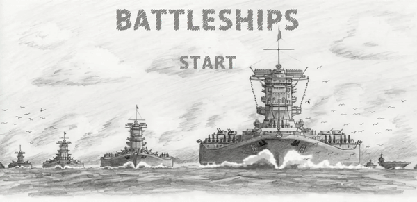

# battleships

🔗 **Live preview:** 
<a href="https://aminumado.github.io/battleships/" target="_blank" rel="noopener noreferrer">View the project here!</a> 👀

<h3>Summary</h3>

This is a Battleship Game where players take turn dropping bombs on each other until one of the players' ships are all sunk. <a href="https://www.theodinproject.com/paths/full-stack-javascript/courses/javascript/lessons/battleship" target="_blank" rel="noopener noreferrer">The Odin Project's</a> javascript curriculum. The goal of this project was to learn how to use  test driven development with Jest and factory functions.

<h3>Demo GIF</h3>

<h4>Desktop</h4>

### Functionality & Features

- You can place your ships manually.
- You can rotate your ships before placing it on your board.
- `Randomize` button places all your ships randomly on your board for you.

## Built with

### Technologies

- HTML
- CSS
- JavaScript 

### Tools

- Visual Studio Code
- Linux terminal
- Git and GitHub
- Npm
- Webpack
- prettier
- eslint

## Outcome

- Used **ES6 Modules** for more modular code.
- Used CSS3 **grid** and **flex** to create layout.
- Used **Git** and **GitHub** for project management.
- Used **Jest** for TDD
- Used **webpack**

## Summary

### What I learned

- ES6 Modules
- Test Driven Development
- Unit Testing with Jest

### Future Fixes

- possibly add a drag and drop feature
- make AI smarter

## Author

👤 **AminuMado**

- GitHub: [AminuMado](https://github.com/AminuMado)
